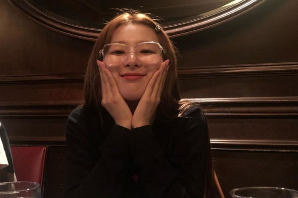

<!DOCTYPE html>
<html lang="en">
<head>
    <meta charset="UTF-8">
    <meta name="viewport" content="width=device-width, initial-scale=1.0">
    <title>PAGYUBAN M</title>
</head>
<body>
    <h1>HALO PASUKAN</h1>
    <h2>Apa kabarnya</h2>
    

    
Niy belajar bikin web pake Github

    
Belajar up skills dari bootcamp yang dikasi tau cece

    
Yey

    <h3>Penyemangat buat kalian:</h3>
    <ol>
        <li>Bokem Amboyoo

</li>
        <li>Adex Aceceyow

</li>
    </ol>
    <h3>Choose your fighter WKWKWK</h3>
    
Okey have a gud dey

    <h3>Last!</h3>
    <a href="https://media.tenor.com/RwAjXPmKX58AAAAC/saleh-abang-saleh.gif">OPEN FOR KEJUTAN</a>
</body>
</html>
